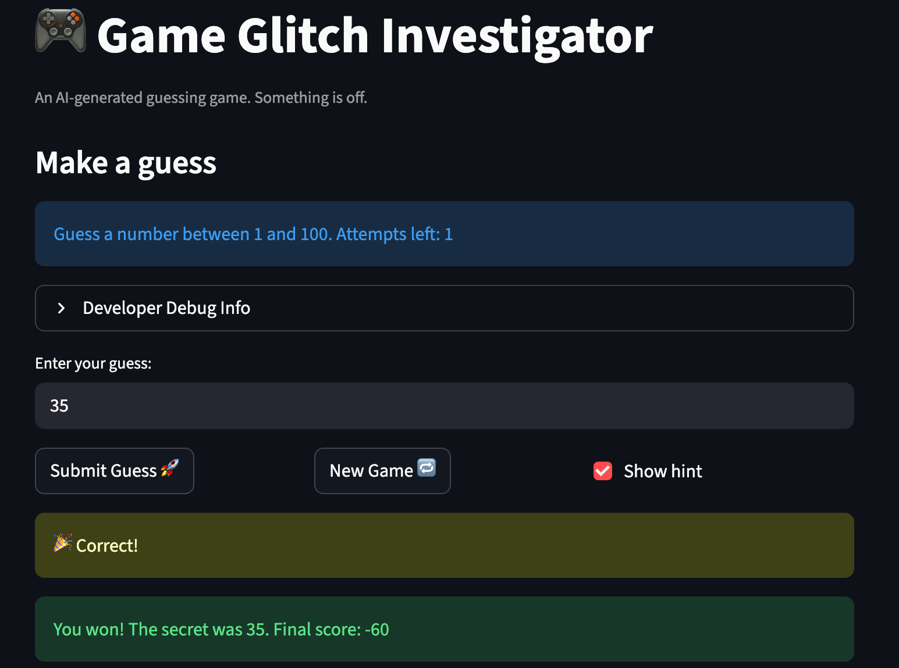

# 🎮 Game Glitch Investigator: The Impossible Guesser

## 🚨 The Situation

You asked an AI to build a simple "Number Guessing Game" using Streamlit.
It wrote the code, ran away, and now the game is unplayable. 

- You can't win.
- The hints lie to you.
- The secret number seems to have commitment issues.

## 🛠️ Setup

1. Install dependencies: `pip install -r requirements.txt`
2. Run the broken app: `python -m streamlit run app.py`

## 🕵️‍♂️ Your Mission

1. **Play the game.** Open the "Developer Debug Info" tab in the app to see the secret number. Try to win.
2. **Find the State Bug.** Why does the secret number change every time you click "Submit"? Ask ChatGPT: *"How do I keep a variable from resetting in Streamlit when I click a button?"*
3. **Fix the Logic.** The hints ("Higher/Lower") are wrong. Fix them.
4. **Refactor & Test.** - Move the logic into `logic_utils.py`.
   - Run `pytest` in your terminal.
   - Keep fixing until all tests pass!

## 📝 Document Your Experience

- [x] Describe the game's purpose.

   This is a Streamlit number-guessing game. Based on the chosen difficulty
  (Easy: 1–20, Normal: 1–100, Hard: 1–50), the app picks a secret number and
  the player has a limited number of attempts (5–8, depending on difficulty)
  to guess it. After each guess, the app reports "Too High," "Too Low," or
  "Win," shows a directional hint, and updates the player's score.

- [x] Detail which bugs you found.

  1. **New Game doesn't reset game status** — clicking "New Game 🔁" after
     winning or losing never reset `st.session_state.status` back to
     `"playing"`, so the game-over guard immediately fired again via
     `st.stop()`, leaving the game permanently stuck.
  2. **Backwards hints** — `check_guess` had the hint text swapped: a "Too
     High" guess showed "📈 Go HIGHER!" and a "Too Low" guess showed
     "📉 Go LOWER!" — the opposite of what the player needed.
  3. **Inconsistent "Too High" scoring** — `update_score` always subtracted 5
     points for "Too Low" guesses, but for "Too High" guesses it only
     subtracted 5 on odd attempts and *added* 5 on even attempts.

- [x] Explain what fixes you applied.
  1. Added `st.session_state.status = "playing"` to the "New Game 🔁" handler
     so a new round actually starts.
  2. Swapped the hint strings in `check_guess` so "Too High" → "📉 Go LOWER!"
     and "Too Low" → "📈 Go HIGHER!".
  3. Removed the even-attempt special case in `update_score` so "Too High"
     always subtracts 5 points, matching "Too Low".
  4. Implemented `logic_utils.py` (previously `NotImplementedError` stubs)
     with the corrected logic, and added pytest coverage in
     `tests/test_game_logic.py` (6/6 tests pass).

## 📸 Demo Walkthrough

The walkthrough below traces a full game on **Normal** difficulty (secret
number is between 1 and 100, 8 attempts allowed) where the secret number is
**50**:

1. A new game starts: `attempts = 1`, `score = 0`, `status = "playing"`.
2. User enters a guess of **30** and clicks "Submit Guess 🚀" → the game
   returns **"Too Low"** with the hint "📈 Go HIGHER!", and the score drops to
   **-5**.
3. User enters a guess of **70** → the game returns **"Too High"** with the
   hint "📉 Go LOWER!", and the score drops to **-10**.
4. User enters a guess of **60** → the game returns **"Too High"** again with
   the hint "📉 Go LOWER!", and the score drops to **-15** — consistently
   subtracting 5 points just like a "Too Low" guess would.
5. User enters a guess of **50** → the game returns **"Win"** 🎉, shows
   balloons, and awards a win bonus, bringing the final score to **25**.
6. User clicks "New Game 🔁" → the game immediately resets: a new secret
   number is generated, `attempts` returns to 0, `status` returns to
   `"playing"`, and the player can submit guesses right away instead of being
   stuck on the "Game over" screen.

**Screenshot**: <!-- Insert a screenshot of your fixed, winning game here -->



## 🧪 Test Results

### Edge-case tests (Challenge 1)

```
$ python -m pytest -v
collected 12 items

tests/test_game_logic.py::test_winning_guess PASSED                      [  8%]
tests/test_game_logic.py::test_guess_too_high PASSED                     [ 16%]
tests/test_game_logic.py::test_guess_too_low PASSED                      [ 25%]
tests/test_game_logic.py::test_too_high_hint_tells_player_to_go_lower PASSED [ 33%]
tests/test_game_logic.py::test_too_low_hint_tells_player_to_go_higher PASSED [ 41%]
tests/test_game_logic.py::test_too_high_always_subtracts_points PASSED   [ 50%]
tests/test_game_logic.py::test_parse_guess_handles_negative_numbers PASSED [ 58%]
tests/test_game_logic.py::test_negative_guess_is_too_low PASSED          [ 66%]
tests/test_game_logic.py::test_parse_guess_handles_decimal_input PASSED  [ 75%]
tests/test_game_logic.py::test_decimal_guess_can_still_win PASSED        [ 83%]
tests/test_game_logic.py::test_parse_guess_handles_extremely_large_numbers PASSED [ 91%]
tests/test_game_logic.py::test_extremely_large_guess_is_too_high PASSED  [100%]

============================== 12 passed in 0.52s ==============================
```

## 🚀 Stretch Features

- [x] **Challenge 4: Enhanced Game UI**

  All enhancements are **presentation-only** — no core logic (`check_guess`, `update_score`, `parse_guess`, `guess_distance`, `closeness`) was modified, and all existing tests still pass.

  **1. Color-coded temperature hint (`app.py` — `if show_hint:` block)**
  Previously the Hot/Warm/Cold temperature label appeared only in the sidebar history. The `if show_hint:` block in `app.py` now also renders the label as large colored text immediately after the directional warning, via:
  ```python
  st.markdown(f"### :{label_color(_lbl)}[{_lbl}] · {round(_frac * 100)}% there")
  ```
  The color token comes from the new pure helper `logic_utils.label_color()`, which maps `🔥 Hot → red`, `🌤️ Warm → orange`, `❄️ Cold → blue` (unknown/empty → `gray`). The closeness label `_lbl` and fraction `_frac` are reused from the values already computed for the history record at `app.py:192` — no logic is duplicated.

  **2. Session summary table (`app.py` — `render_summary_table()`)**
  A new `📊 Session Summary` `st.dataframe` shows every guess in the session with columns **Attempt #, Guess, Outcome, Temperature, Closeness %**. Rows are built by the new pure helper `logic_utils.history_to_rows()` from `st.session_state.history`; Invalid guesses (where `fraction is None`) display `—` for Temperature and Closeness %. The table is rendered by `render_summary_table()` in `app.py` in two places:
  - **During play:** collapsed expander above the footer, so players can open it at any time.
  - **Win / lose recap:** expanded automatically once the game ends, both on the submit-result screen and on the persistent game-over screen.

  **3. New unit tests (`tests/test_game_logic.py`)**
  Added `test_label_color_maps_temperatures` and `test_history_to_rows_handles_invalid_row` to cover the new helpers, including the Invalid-row edge case where `fraction is None`.
